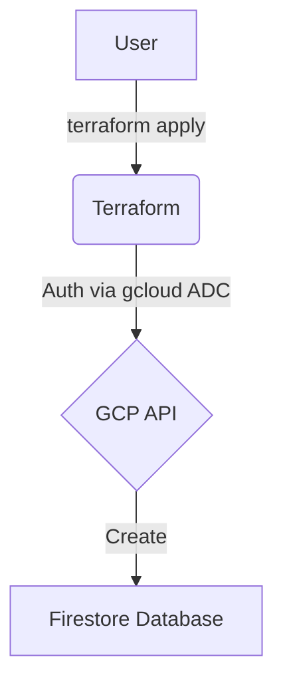
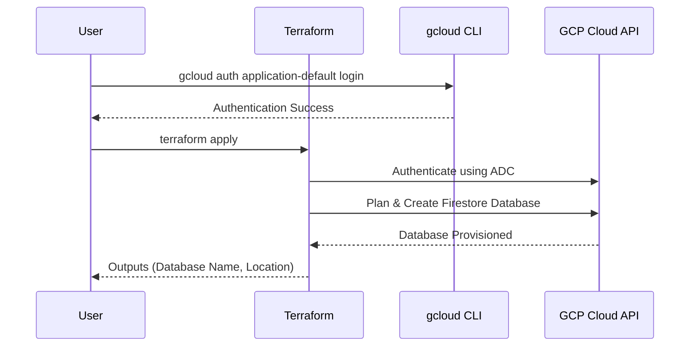

# terraform-gcp-db--firestore

This Terraform project provisions a Google Cloud Firestore database.

## Architecture

### Flowchart



### Sequence Diagram



## Firestore Specifications

- **Database Mode**: `NATIVE_MODE` or `DATASTORE_MODE`.
- **Location**: Restricted to `us-west1`, `us-central1`, or `us-east1` (GCP Always Free Tier regions).
- **Type**: Defaults to `FIRESTORE_NATIVE`.
- **Provisioning Only**: This project creates the Firestore database resource only; no collections or documents are created.

## GCP Free Tier Limits (Always Free)

To stay within the free tier, ensure your usage does not exceed:

- **Document Reads**: 50,000 per day.
- **Document Writes**: 20,000 per day.
- **Document Deletes**: 20,000 per day.
- **Storage**: 1 GiB of stored data.
- **Network Egress**: 10 GiB per month (within the same region).

## Prerequisites

1.  **Google Cloud SDK**: [Installed and initialized](https://cloud.google.com/sdk/docs/install).
2.  **Terraform**: [Installed](https://developer.hashicorp.com/terraform/downloads).

## Setup & Deployment

1.  **Authenticate and Select Project**:
    Instead of using a service account JSON file, this project uses your local `gcloud` credentials.

    ```bash
    # Authenticate
    gcloud auth application-default login

    # Select your project
    gcloud config set project your-project-id
    ```

2.  **Configure Variables**:
    Create a `terraform.tfvars` file based on the example:

    ```hcl
    project_id = "your-project-id"
    region     = "us-central1"
    database_id = "my-firestore-database"
    ```

3.  **Deploy**:

    ```bash
    # Initialize
    terraform init

    # Apply changes
    terraform apply
    ```

4.  **Outputs**:
    After a successful deployment, Terraform will output the database details.

## CI/CD Setup (GitHub Actions)

1. **Enable the Firestore API** in your GCP project:

   ```bash
   gcloud services enable firestore.googleapis.com
   ```

2. **Create a service account** with the `Cloud Datastore Owner` role and generate a JSON key:
   - GCP Console → IAM & Admin → Service Accounts → Create Service Account
   - Grant role: **Cloud Datastore Owner**
   - Keys → Add Key → Create New Key → JSON
   - Copy the entire JSON file contents

3. **Add a GitHub secret** named `GCP_SA_KEY` containing the full JSON key from step 2:
   - GitHub repo → Settings → Secrets and variables → Actions → New repository secret
   - Name: `GCP_SA_KEY`
   - Value: (paste the entire JSON contents)

4. **Create a GCS bucket** for Terraform remote state (if not already created):

   ```bash
   gcloud storage buckets create gs://your-terraform-state-bucket \
     --location=us-central1 \
     --uniform-bucket-level-access
   ```

5. **Add GitHub Secrets** for backend state bucket:

   | Secret Name        | Value                                                      |
   | ------------------ | ---------------------------------------------------------- |
   | `TF_BUCKET_NAME`   | Your GCS bucket name (e.g., `your-terraform-state-bucket`) |
   | `TF_BUCKET_PREFIX` | Bucket prefix/path (e.g., `terraform-gcp-cloud-sql`)       |

6. **Run the workflow**:
   - **Apply**: Go to Actions → **CD - Terraform Apply** → fill in all inputs
   - **Destroy**: Go to Actions → **CD - Terraform Destroy** → fill in essential inputs only

> Alternatively, create a `backend.tfvars` from `backend.tfvars.example` and reference it with `terraform init -backend-config="backend.tfvars"` for local use.

## Usage as a Module

Reference this repository as a Terraform module in your own configurations:

> **Option 1**: Terraform Registry (recommended)
>
> ```hcl
> module "db-firestore" {
>   source  = "marcuwynu23/db-firestore/gcp"
>   version = "1.0.0"
>
>   project_id    = var.project_id
>   region        = "us-central1"
>   database_id   = "my-app-firestore"
>   database_type = "FIRESTORE_NATIVE"
> }
> ```
>
> **Option 2**: GitHub source
>
> ```hcl
> module "db-firestore" {
>   source = "github.com/marcuwynu23/terraform-gcp-firestore?ref=main"
>
>   project_id    = var.project_id
>   region        = "us-central1"
>   database_id   = "my-app-firestore"
>   database_type = "FIRESTORE_NATIVE"
> }
> ```

Then use the outputs in your configuration:

```hcl
# Example: pass the database name to a Cloud Run service
resource "google_cloud_run_v2_service" "app" {
  # ...
  template {
    containers {
      env {
        name  = "FIRESTORE_DATABASE"
        value = module.firestore_db.database_name
      }
    }
  }
}
```

## Variables

| Variable        | Description                                                 | Type     | Default              |
| --------------- | ----------------------------------------------------------- | -------- | -------------------- |
| `project_id`    | GCP project ID                                              | `string` | (required)           |
| `region`        | GCP region (free tier: us-west1, us-central1, us-east1)     | `string` | `"us-central1"`      |
| `database_id`   | Firestore database ID                                       | `string` | `"default"`          |
| `database_type` | Firestore database type: FIRESTORE_NATIVE or DATASTORE_MODE | `string` | `"FIRESTORE_NATIVE"` |

## Outputs

| Output              | Description                            |
| ------------------- | -------------------------------------- |
| `database_name`     | Name of the created Firestore database |
| `database_id`       | ID of the created Firestore database   |
| `database_location` | Location of the Firestore database     |
